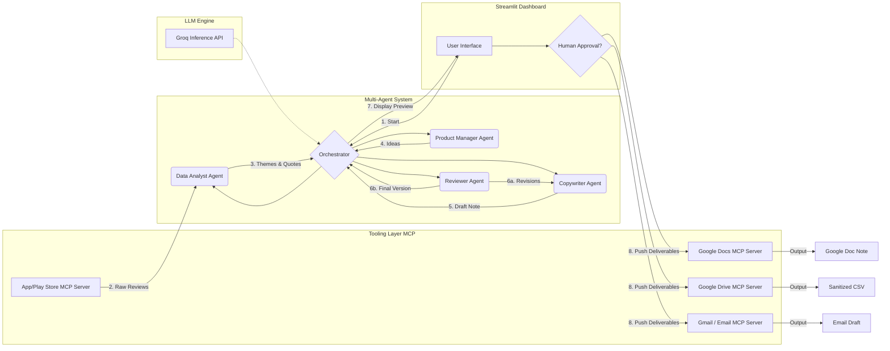

# System Architecture: Multi-Agent Weekly App Reviews Pulse for Groww

## 1. System Overview
The system automates the ingestion, analysis, and summarization of app store reviews for the **Groww** application. It leverages **Groq** for high-speed inference and **MCP (Model Context Protocol)** for external integrations. The system features a "Human-in-the-Loop" workflow via a **Streamlit** frontend. 

Crucially, the system bypasses local file storage for deliverables, instead utilizing **Google Docs** and **Google Drive** via MCP to ensure professional, cloud-based organization.

## 2. High-Level Multi-Agent Architecture

## 3. The "Human-in-the-Loop" Frontend
- **Live Agent Feed:** Visual log of agent collaboration.
- **Approval Gate:** The system pauses for human review.
- **One-Click Distribution:** Upon approval, the system simultaneously creates a **Google Doc**, uploads the **Sanitized CSV** to Google Drive, and creates a **Gmail Draft**.

## 4. Strict Compliance & Constraints Matrix
1. **No Behind-Login Scraping:** Uses only public review feeds.
2. **Zero PII:** Scrubbed via regex/NLP before entering LLM.
3. **Max 5 Themes:** Enforced by Analyst prompt.
4. **Scannability (≤250 words):** Enforced by Reviewer loop.

## 5. Tool Integration via MCP
- **`mcp-server-app-store`:** Fetches real-time public reviews.
- **`mcp-server-gmail`:** Creates the draft.
- **`mcp-server-google-docs`:** Creates the official one-page weekly note deliverable.
- **`mcp-server-google-drive`:** Stores the sanitized CSV dataset.

## 6. Deployment & Tech Stack
- **Framework:** Pure Python Orchestration (utilizing a stateful `GrowwPulseOrchestrator` class).
- **Brain:** Groq.
- **UI:** Streamlit.
- **Hosting:** Render.

## 7. Agent Roles
(Unchanged roles: Orchestrator, Analyst, PM, Writer, Reviewer)
